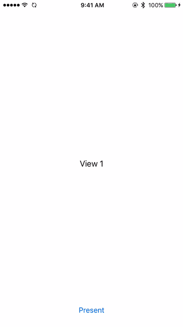

# EmergePresentationManager

**This is the Swift 2.0 branch. Due to a bug in the compiler, the delegate methods are passed CGSizes instead of CGRects.**

This is a class that animates modal views emerging from an arbitrary location onscreen. For example, if tapping a button results in a modal view being presented, you can use this class to have the view appear from the button instead of from the bottom of the screen.

## Demo



## Usage

There are a few steps to start using this class. To begin, add EmergePresentationManager.swift to your project.
 
A EmergePresentationManager instance is designed to be set as the `transitioningDelegate` on the presented view controller. However, since this property is weak, you should maintain a strong reference to the EmergePresentationManager instance, most likely by storing it in a property.

```swift
lazy var emergePresentationManager = EmergePresentationManager();
```

The EmergePresentationManager knows where to emerge from by asking its delegate, which in practice is most likely to be the presenting UIViewController.

```swift
class ViewController: UIViewController, EmergePresentationManagerDelegate { ... }
```

At some point before the actual presentation, make sure the delegate property is set on the EmergePresentationManager instance.

```swift
override func viewDidLoad() {
   emergePresentationManager.delegate = self;
}
```

When you're ready to present a view controller, configure it as so:

```swift
let vc = //get the view controller to present
vc.modalPresentationStyle = .Custom; //IMPORTANT! Forgetting to set this will result in weirdness
vc.transitioningDelegate = emergePresentationManager;
```

Finally, inform the EmergePresentationManager instance where to begin the animation by implementing, at minimum, either the `emergePresentationManager:frameToEmergeFromForFinalSize:` or `emergePresentationManager:viewToEmergeFromForFinalSize:` delegate methods. The frame-returning functions are preferred over the view-returning functions if both are implemented.

```swift
func emergePresentationManager(manager:EmergePresentationManager, viewToEmergeFromForFinalSize finalSize:CGSize) -> UIView {
   return theViewToEmergeFrom;
}
```

If you choose to implement `emergePresentationManager:frameToEmergeFromForFinalSize:` instead, make sure to return a frame in the window base coordinate system. You can do this by using UIView's `convertRect:toView:` method and passing in nil for the `toView` parameter.

```swift
func emergePresentationManager(manager:EmergePresentationManager, frameToEmergeFromForFinalSize finalSize:CGSize) -> CGRect {
   return theViewToEmergeFrom.convertRect(theViewToEmergeFrom.bounds, toView: nil);
}
```

##Customization
Sometimes you want the modal view to return to a different location than from where it emerged. To do so, simply implement either of the `emergePresentationManager:frameToReturnToForInitialSize:` or `emergePresentationManager:viewToReturnToForInitialSize:` delegate methods.

By default, the presented view is display in a form-sheet format when the horizontal size class is regular, such as on an iPad or an iPhone 6 Plus in landscape. To present as fullscreen on all devices, return `true` from the `shouldAlwaysPresentFullScreenForEmergePresentationManager:` method.

Other behavior, such as the animation duration, can be customized by implementing the appropriate delegate methods.

##Tips
If you have multiple view controllers, each to be presented from different points onscreen, it's easiest to create multiple EmergePresentationManager instances with the same delegate. Then, you can disambiguate between them by using `===` in Swift or `==` in Objective-C on the provided `manager` parameter. For example:

```swift
lazy var manager1 = EmergePresentationManager();
lazy var manager2 = EmergePresentationManager();
lazy var manager3 = EmergePresentationManager();
...
func emergePresentationManager(manager:EmergePresentationManager, viewToEmergeFromForFinalSize finalSize:CGSize) -> UIView {
   if(manager === manager1) { return view1; }
   if(manager === manager2) { return view2; }
   return view3;
}
```